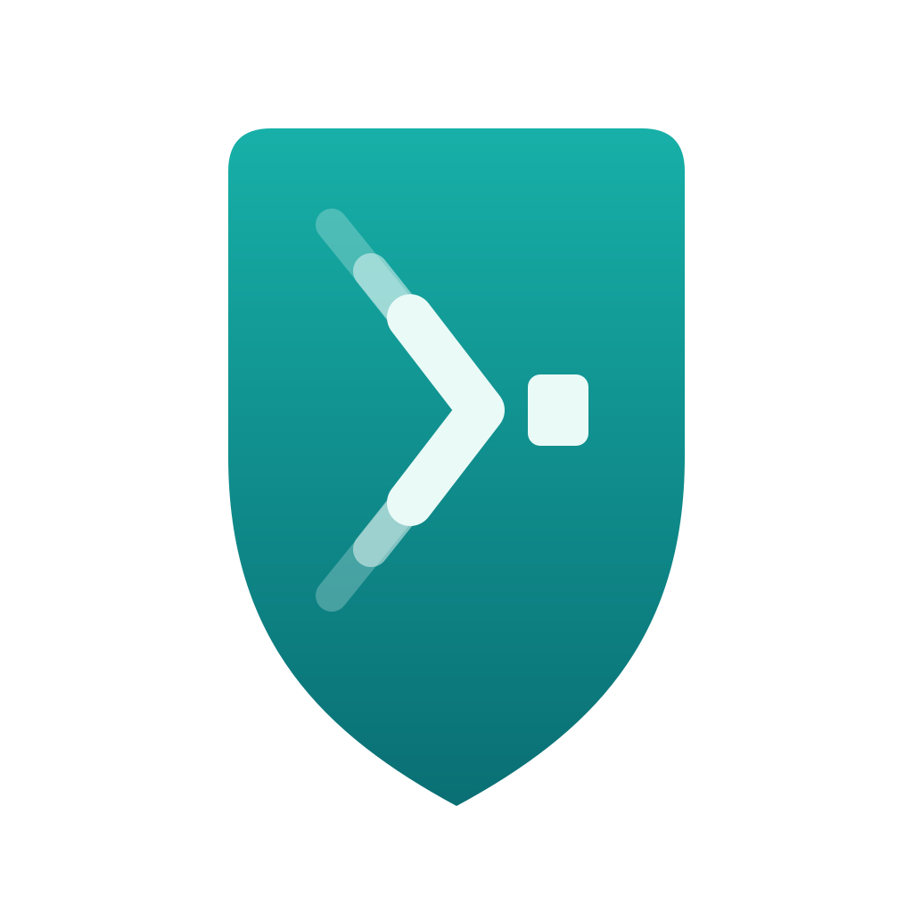
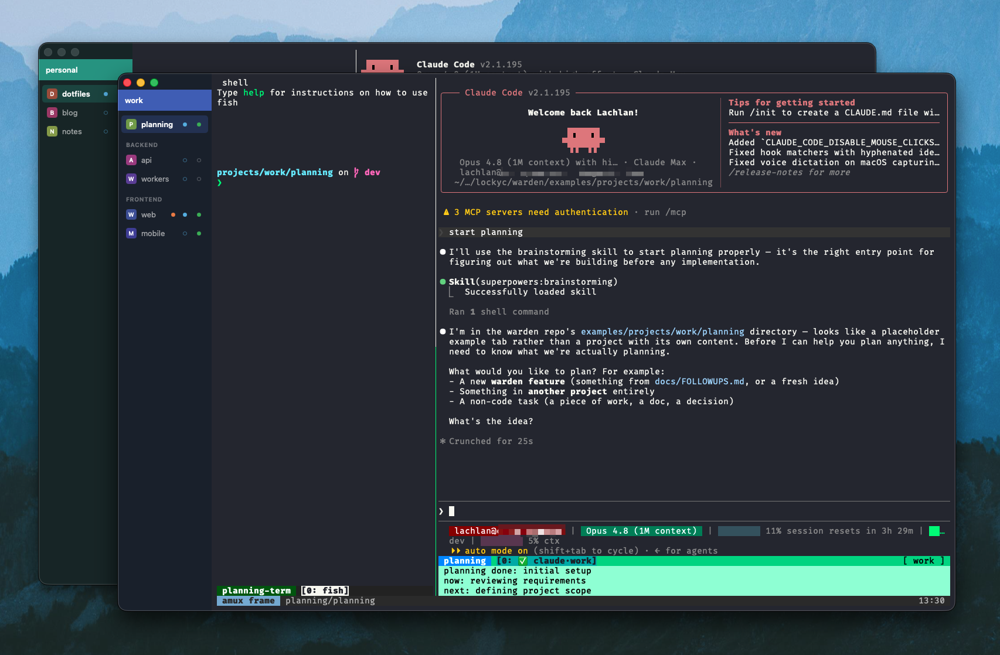

<div align="center">



# warden

**A curator for your terminals** — windows, projects, and (mostly) muxers all the way down.

[](https://github.com/Lockyc/warden/releases/latest)


[](LICENSE)



</div>

warden is a **config-driven terminal multiplexer**. One TOML file is the source of truth: it defines **windows** and the **project tabs** inside them. warden materializes itself from that config and **hot-reloads on save**. Each window carries a colour + title banner for at-a-glance identity; each tab is a real terminal opened in a working directory, running an optional command.

warden is **generic and content-agnostic** — it knows nothing about any specific tool, so the command a tab runs is whatever you want: a shell, a TUI, a build watcher, an agent launcher. It stands on its own.

It's also built for a flow: I pair each tab with [**agentmux**](https://github.com/lockyc/agentmux) (`amux`), a tmux-based agent launcher — so the stack nests `warden → agentmux → tmux` (warden itself embedding [libghostty](https://github.com/ghostty-org/ghostty) as its terminal surfaces). A multiplexer for a multiplexer for a multiplexer; it's turtles the rest of the way down.

Targets **macOS**. Linux is a possible future direction, not a commitment; the config crate stays platform-neutral to keep that door open. Not Windows.

## Features

- **A window per `[[window]]`** — native macOS windows, each with a colour + title banner, a curator-style draggable sidebar, and the terminal under an overlay titlebar.
- **Project tabs** — each tab is a real terminal in a working directory. `load_on_open` tabs spawn at launch and keep running; the rest spawn lazily on first focus. Tabs can be **grouped** into labelled sidebar sections.
- **Live hot-reload** — edit the config and windows and tabs are added, removed, recoloured, and re-sectioned live on save. A missing or invalid config opens a diagnostic window; a parse error mid-edit keeps the last-good windows up behind an error banner.
- **Tab-row affordances** — a letter/colour tile and a **live/cold dot** (filled when the terminal is spawned, hollow when cold). Hover a live dot for a ✕ that **unloads** the tab — kills the terminal and PTY; it respawns a fresh shell on next focus.
- **Notifications** — a background tab that rings the bell or emits a desktop-notification escape (OSC 9 / OSC 777) gets an amber badge, and a desktop notification additionally raises a macOS banner; the badge clears on focus. This is the channel [agentmux](https://github.com/lockyc/agentmux)'s Claude hooks feed instead of shelling out to `osascript`.
- **Session-presence probes** — a per-tab `probe` command lights a cyan dot when it exits 0, independent of whether warden's own terminal surface is loaded (details below).
- **Keyboard navigation** (the **Tab** menu) — **⌘⇧[** / **⌘⇧]** cycle the previous/next *loaded* tab (cold tabs are skipped) and **⌘1–⌘9** jump to a position; set `tab_digit_keys = "cycle"` to make **⌘1** / **⌘2** cycle instead (jumps shift to **⌘3–⌘9**). **⌘W** unloads the active tab and **⌘⇧W** closes the window (Safari/Chrome convention).
- **CLI** — `warden validate` prints the resolved window/tab tree and warnings; `warden fmt` formats a config in warden's house TOML style.

To wire the session-presence dot — pairing with [agentmux](https://github.com/lockyc/agentmux) — set a tab's `probe` to a session check:

```toml
probe = '/opt/homebrew/bin/tmux has-session -t "=$(basename "$PWD" | tr .: __)" 2>/dev/null'
```

so the dot shows whether its amux session is alive. `probe_interval` controls the cadence (`0` = check on focus/hot-reload only). Two things to get right, because warden runs the probe via bare `sh -c` with the *app's own* environment: name `tmux` by **absolute path** (a Finder/Dock-launched `warden.app` has a minimal PATH that omits `/opt/homebrew/bin`, so bare `tmux` is silently command-not-found — adjust the path to your `which tmux`), and **don't pass `-L`** (amux's agent sessions live on tmux's default socket).

A tab's optional `kill` command (same cascade, same absolute-path / no-`-L` caveats) severs the session the dot represents: click the cyan dot once to arm, click again to confirm, and warden runs `kill` fire-and-forget — the surface stays open, and the probe re-runs immediately to update the dot. Since the control lives on the presence dot, `kill` only does anything on a tab that also sets `probe` (no probe ⇒ no dot to click).

Not yet built (see [`docs/FOLLOWUPS.md`](docs/FOLLOWUPS.md)): `cmd+\`` window cycling, ad-hoc `cmd+T` / `cmd+N` tabs and windows, and a controlled libghostty **source** build (the vendored binary is a throwaway prebuilt, currently blocked on a Zig 0.15.2 / macOS 26 SDK mismatch).

## Config

`~/.config/warden/config.toml` (override with `WARDEN_CONFIG`):

```toml
shell = "fish -l"            # global default shell every tab spawns
format_on_save = true        # optional; rewrite this file tidy on each clean save (default off)
respawn_on_scale_change = true  # optional; recreate a tab's terminal when the display DPI changes
                             #   (e.g. unplugging a monitor) so the font re-renders. Restarts the
                             #   tab's process (amux reattaches). Default off.

[[window]]                   # a native macOS window
title  = "work"
colour = "#0f8a8a"           # optional; omit for a neutral default
width  = 1500                # optional; initial width (px, default 1500)
height = 1000                # optional; initial height (px, default 1000)
cmd    = "amux"              # this window's default startup command (each tab can override)

  [[window.tab]]             # a project terminal
  title      = "myproject"   # optional; defaults to the dir basename
  dir        = "~/code/myproject"
  load_on_open = true        # optional; spawn at launch and keep running

  [[window.tab]]
  title = "notes"
  dir   = "~/notes"
  cmd   = ""                 # opt out: just a bare shell here

  [[window.group]]           # optional: a labelled sidebar section
  name = "services"
    [[window.group.tab]]     # same fields as [[window.tab]]
    title = "api"
    dir   = "~/code/api"
```

A window has its own colour + title banner; its tabs are project terminals. `width` and `height` set the initial window size (defaults 1500×1000; saved state overrides after the first launch). Each tab opens a `shell`; a tab's `cmd` is auto-run *inside* that shell (it's typed in, not exec'd, so a shell function like [agentmux](https://github.com/lockyc/agentmux)'s `amux` works and you drop back to a live shell when it exits). Both `shell` and `cmd` **cascade** — set them globally, per-window, or per-tab, and the nearest level wins (`cmd = ""` opts a level out of an inherited command). `load_on_open` tabs start at launch and keep running in the background. Tabs can be **grouped** into labelled sidebar sections with `[[window.group]]`; loose `[[window.tab]]`s (no group) appear first in a headerless section. Grouping is cosmetic — it just sections the sidebar. Set `format_on_save = true` to have warden rewrite the config in house style on each clean hot-reload (the same formatting `warden fmt` applies).

## Install

**Guided (Claude Code):** run `/warden:install` — it checks prerequisites
(Xcode Command Line Tools, Rust, the Tauri CLI), builds warden from source, installs
it to `/Applications`, and seeds your config.

**One-liner:**

```sh
curl -fsSL https://raw.githubusercontent.com/lockyc/warden/main/install.sh | bash
```

This clones warden to `~/.warden`, builds the release bundle (`cargo tauri build`),
installs `warden.app` to `/Applications`, and seeds `~/.config/warden/config.toml`
from the example if you don't already have one. Re-run it any time to update
(it git-pulls and rebuilds). macOS only.

Prerequisites: macOS, Xcode Command Line Tools, a Rust toolchain
([rustup](https://rustup.rs)). The installer installs the Tauri CLI itself if missing.

## Build & use

With [`just`](https://github.com/casey/just) (run `just` to list recipes):

```sh
just run          # launch the app against examples/config.toml (never touches your real config)
just validate     # validate the demo config (pass a path to validate another)
just test         # workspace tests
just fmt          # format Rust sources (cargo fmt)
just clippy       # lint (warnings as errors)
just build        # build the release warden.app (needs: cargo install tauri-cli --version ^2)
just deploy       # build, install to /Applications, and relaunch
```

Builds are **signed with Developer ID and notarized** automatically when the Apple signing/notary env vars are set in the build environment (`APPLE_SIGNING_IDENTITY` pointing at a Developer ID Application cert, plus `APPLE_ID`/`APPLE_PASSWORD`/`APPLE_TEAM_ID`, or `APPLE_API_KEY*`) — so release artifacts open on other Macs without a Gatekeeper block. Without those vars (e.g. building from source as a contributor), the build is ad-hoc/unsigned and `just deploy` strips the Gatekeeper quarantine xattr so the local copy still runs.

Or with cargo directly:

```sh
cargo build
cargo test
cargo run -p warden-app                                # launch the app (macOS; reads WARDEN_CONFIG or ~/.config/warden/config.toml)
cargo run -p warden-config --bin warden -- validate    # validate ~/.config/warden/config.toml
cargo run -p warden-config --bin warden -- validate path/to/config.toml
cargo run -p warden-config --bin warden -- fmt         # format ~/.config/warden/config.toml in place
cargo run -p warden-config --bin warden -- fmt path/to/config.toml
cargo run -p warden-config --bin warden -- fmt --check path/to/config.toml  # check only, no write
```

`warden-app` materializes a window for each `[[window]]` and hot-reloads on save; edit the config while it's running to watch windows and tabs appear, disappear, and recolour live.

`warden validate` prints the resolved windows/tabs and any warnings; exit code 0 (ok), 1 (load/parse/validation error), 2 (usage). `warden fmt` rewrites a config in warden's house TOML style — consistent indentation, aligned `=`, section spacing (`--check` reports without writing, for a CI gate); `format_on_save = true` applies the same formatting automatically on each clean save.

## Layout

- `crates/warden-config/` — the config crate (library + `warden` CLI).
- `crates/warden-app/` — the macOS Tauri app: windows, the sidebar tab list, libghostty surfaces behind the `TerminalSurface` seam, and hot-reload wiring.
- `assets/` — icon masters (`icon.svg`, `icon-app.svg`), rendered PNGs, the macOS `warden.icns`, and `build-icons.sh` to regenerate the rasters from the SVGs.
- `docs/FOLLOWUPS.md` — tracked list of intentionally-deferred work.

## License

MIT — see [`LICENSE`](LICENSE).

The vendored libghostty binary (`crates/warden-app/vendor/`) is third-party code
distributed under its own MIT license (Ghostty); see
[`crates/warden-app/vendor/LICENSE-ghostty`](crates/warden-app/vendor/LICENSE-ghostty)
and `PROVENANCE.md` in that directory.
