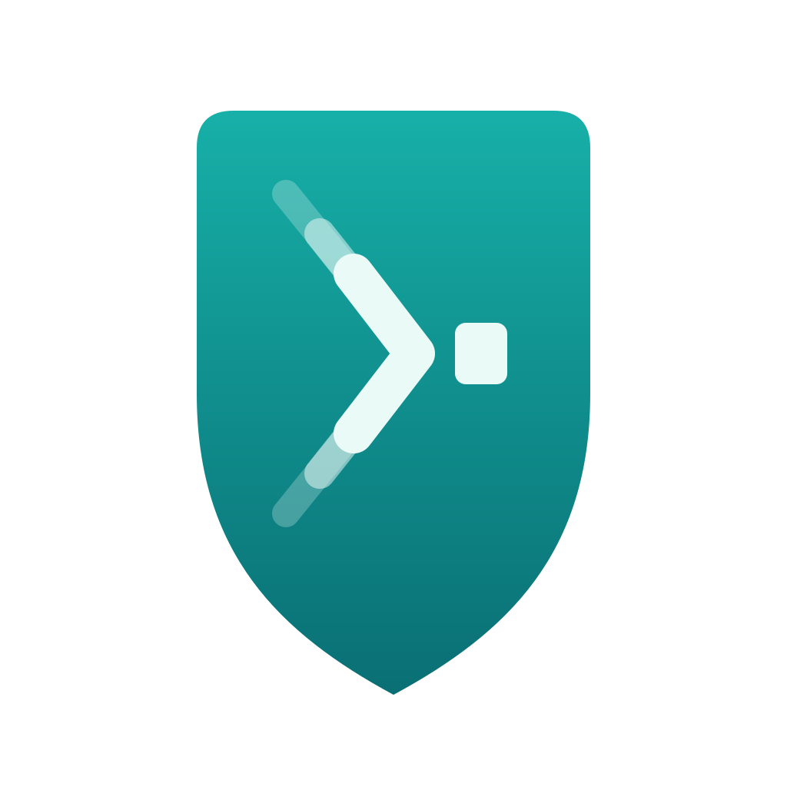
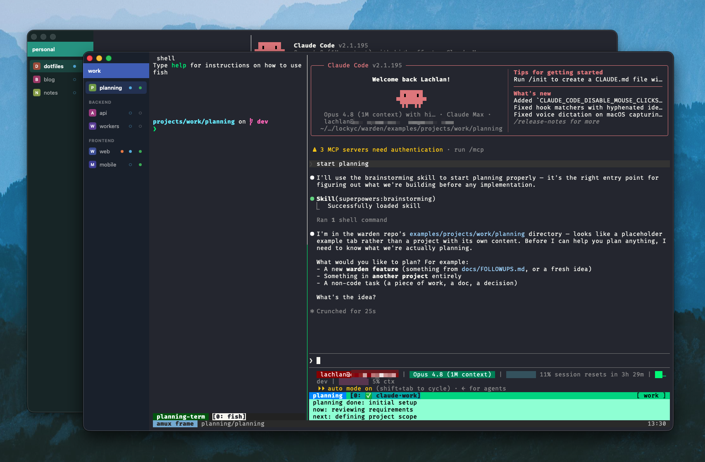

<div align="center">



# warden

**A curator for your terminals** — windows, projects, and (mostly) muxers all the way down.

[](https://github.com/Lockyc/warden/releases/latest)
[](https://github.com/Lockyc/warden/actions/workflows/ci.yml)


[](LICENSE)



</div>

warden is a **config-driven terminal multiplexer**. One TOML file is the source of truth: it defines **windows** and the **project tabs** inside them. warden materializes itself from that config and **hot-reloads on save**. Each window carries a colour + title banner for at-a-glance identity; each tab is a real terminal opened in a working directory, running an optional command.

warden is **generic and content-agnostic** — it knows nothing about any specific tool, so the command a tab runs is whatever you want: a shell, a TUI, a build watcher, an agent launcher. It stands on its own.

It's also built for a flow: I pair each tab with [**agentmux**](https://github.com/lockyc/agentmux) (`amux`), a tmux-based agent launcher — so the stack nests `warden → agentmux → tmux` (warden itself embedding [libghostty](https://github.com/ghostty-org/ghostty) as its terminal surfaces). A multiplexer for a multiplexer for a multiplexer; it's turtles the rest of the way down.

Targets **macOS**. Linux is a possible future direction, not a commitment; the config crate stays platform-neutral to keep that door open. Windows isn't addressed today — the terminal surface is a macOS-native embed — but it's unstarted, not ruled out.

## Features

- **A window per `[[window]]`** — native macOS windows, each with a colour + title banner, a curator-style draggable sidebar, and the terminal under an overlay titlebar. The **Window** menu lists every configured window — raise an open one or reopen one you've closed (**⌘⇧T** reopens the last closed).
- **Persistent, not last-window-quit** — warden opens the windows you mark `open_on_start` (default all) and shows a **home surface** when none are open, listing every configured window so you can raise or reopen one with a click. It's a persistent app: closing the last window never quits it — **⌘Q** does.
- **Project tabs** — each tab is a real terminal in a working directory. `load_on_open` tabs spawn at launch and keep running; the rest spawn lazily on first focus. Tabs can be **grouped** into labelled sidebar sections.
- **Project trees** — point a `[[window.root]]` at a directory (e.g. `~/Developer`) and warden auto-discovers every git project under it, rendering them as a collapsible tree of tabs — no per-project config needed. Pair it with amux `probe`/`kill` for a per-project session dot on every discovered project.
- **Live hot-reload** — edit the config and windows and tabs are added, removed, recoloured, and re-sectioned live on save. A missing config offers to create a starter one and an invalid one shows the error, both on the **home surface**; a parse error mid-edit instead keeps the last-good windows up behind an error banner. The **Config** menu opens the config file in your default editor or reveals it in Finder, so you needn't remember its path.
- **Tab-row affordances** — a letter/colour tile and a **live/cold dot** (filled when the terminal is spawned, hollow when cold). Hover a live dot for a ✕ that **unloads** the tab — kills the terminal and PTY; it respawns a fresh shell on next focus.
- **Pop-out tabs** — pop the active tab into its own banner-only window with **⌘⇧O** (or the ⤢ control on its row). It's **session-preserving**: the live terminal, its scrollback, and the running process move across untouched — no restart. Closing the popped-out window returns the tab to where it came from (reopening its origin window first if you'd closed it), and a ⇱ control pops it back in from the sidebar.
- **Live terminal affordances** — URLs in a terminal are **clickable**: hover one for a hand cursor, click to open it in your default browser. And when a tab's process exits (the shell quits, an agent finishes), the tab goes **cold** — the dot empties and the row respawns a fresh shell on next focus — rather than stranding a dead "Process exited" screen.
- **Notifications** — a background tab that rings the bell or emits a desktop-notification escape (OSC 9 / OSC 777) gets an amber badge, and a desktop notification additionally raises a macOS banner; the badge clears on focus. This is the channel [agentmux](https://github.com/lockyc/agentmux)'s Claude hooks feed instead of shelling out to `osascript`.
- **Session-presence probes** — a per-tab `probe` command drives a three-state dot from its exit code: cyan on exit 0 (live), a ghost on exit 3 (crashed but restorable), hollow otherwise — independent of whether warden's own terminal surface is loaded (details below).
- **Keyboard navigation** (the **Tab** menu) — **⌘⇧[** / **⌘⇧]** cycle the previous/next *loaded* tab (cold tabs are skipped) and **⌘1–⌘9** jump to a position; set `tab_digit_keys = "cycle"` to make **⌘1** / **⌘2** cycle instead (jumps shift to **⌘3–⌘9**). **⌘W** unloads the active tab, **⌘⇧W** closes the window (Safari/Chrome convention), and **⌘⇧O** pops the active tab into its own window (session-preserving; see above).
- **CLI** — `warden validate` prints the resolved window/tab tree and warnings; `warden fmt` formats a config in warden's house TOML style.

To wire the session-presence dot — pairing with [agentmux](https://github.com/lockyc/agentmux) — set a tab's `probe` to a session check:

```toml
probe = '"$HOME/.agentmux/bin/amux" --probe'
```

so the dot shows whether its amux session is alive — `amux --probe` exits 0 for the agent session **or** a lingering frame (so the dot stays lit if the agent exits but the frame wrapper is still up; a plain bare-amux without a frame only ever has the agent). It exits 3 instead when the session's gone but restorable — a plain `amux` launch here would offer its restore picker — which warden shows as a ghost rather than cyan. amux owns the session naming and socket layout, so the probe stays a one-liner that can't drift from amux's internals. `probe_interval` is the **settled slow-poll floor in seconds** (default 5) — not the whole cadence: every trigger (tab activate, start, kill, hot-reload, focus) pushes that window into a *fast burst* which polls until the state stops changing, then drops back to this floor, so the rate between a trigger and settling is far higher than the floor. `0` means **event-driven-then-idle** — still bursting on every trigger, just no steady poll between them; it is not "no probing". Because the burst rate is fixed, **`probe_interval` cannot bound the cost of a slow probe command** — keep the probe itself fast. Cadence, bursts and their bounds: [docs/probing.md](docs/probing.md). Name amux by **absolute path**: warden runs the probe via `sh -c` with the `.app`'s own env, which is minimal on a Finder/Dock launch — amux's internal `tmux` calls then resolve via the **login-shell PATH** warden imports at startup. Not using agentmux? Point `probe` at any check that exits 0 when your session exists.

A tab's optional `kill` command severs the session the dot represents: click the cyan dot once to arm, click again to confirm, and warden runs `kill` fire-and-forget — the surface stays open, and the probe re-runs immediately to update the dot. With agentmux, set it to `'"$HOME/.agentmux/bin/amux" --kill'` (cwd = the tab dir): the mirror of `amux --probe`, it tears down the **whole project** — the agent session plus its frame and scratch terminal — so it reaps exactly what the probe detects. Since the control lives on the presence dot, `kill` only does anything on a tab that also sets `probe` (no probe ⇒ no dot to click).

The mirror also holds. When the probe reports the session **gone** on a tab whose terminal is still live — hollow or ghost alike — the same dot becomes a one-click **start**: warden types the tab's `cmd` into the existing shell, so a dead or crashed agent session restarts (or restores) in place — scrollback preserved, no terminal respawn.

Not yet built (see [`docs/FOLLOWUPS.md`](docs/FOLLOWUPS.md)): ad-hoc `cmd+T` / `cmd+N` tabs and windows.

## Config

`~/.config/warden/config.toml` (override with `WARDEN_CONFIG`):

```toml
shell = "fish -l"            # global default shell
format_on_save = true        # rewrite this file tidy on each clean save
density = "compact"          # condensed chrome

[[window]]                   # a native macOS window
title  = "work"
colour = "#0f8a8a"           # banner accent
width  = 1500                # initial size, px
height = 1000
cmd    = "amux"              # this window's default startup command (each tab can override)

  [[window.tab]]             # a project terminal
  title      = "myproject"   # defaults to the dir basename
  dir        = "~/code/myproject"
  load_on_open = true        # spawn at launch and keep running

  [[window.tab]]
  title = "notes"
  dir   = "~/notes"
  cmd   = ""                 # opt out: just a bare shell here

  [[window.group]]           # optional: a labelled sidebar section
  name = "services"
    [[window.group.tab]]     # same fields as [[window.tab]]
    title = "api"
    dir   = "~/code/api"

  [[window.root]]            # optional: scan a dir; every git repo under it becomes a tab
  name = "Developer"
  dir  = "~/Developer"
```

### Every option

**Global** (top of the file):

| Key | Default | What it does |
| --- | --- | --- |
| `shell` | your login shell, run as a login shell | The shell every tab spawns. Cascades. |
| `cmd` | none | Command typed into that shell on spawn. Cascades. |
| `probe` | none | Session-presence check, run per tab (cwd = the tab's dir): exit 0 ⇒ cyan dot, exit 3 ⇒ ghost (restorable), anything else ⇒ hollow. Cascades. |
| `probe_interval` | `5` | Slow-poll floor in seconds once a burst settles. `0` = event-driven only (still bursts on triggers, no steady poll). |
| `kill` | none | Session-kill command, run on a two-step confirm click of the presence dot. Cascades. Only reachable on a tab that also sets `probe`. |
| `format_on_save` | `false` | Rewrite this file in house style on each clean save (same formatting as `warden fmt`). |
| `density` | `"comfortable"` | Chrome sizing. `"compact"` scales type + spacing down proportionally for denser tab lists. |
| `tab_digit_keys` | `"jump"` | ⌘1–⌘9 jump to a tab position. `"cycle"` makes ⌘1 / ⌘2 cycle next/prev instead, shifting jumps to ⌘3–⌘9. |
| `sidebar_drag` | `true` | The non-interactive sidebar chrome doubles as a window-move drag handle. |
| `auto_update` | `true` | Check for a new release on launch and every 6h. `false` suppresses the auto-check; **Check for Updates…** still works. Takes effect at next launch. |
| `notify_debug` | `false` | Trace the notification path to `$TMPDIR/warden-notify-dbg.log` — a debug aid, read at launch (see [`docs/notifications.md`](docs/notifications.md)). |

**`[[window]]`** — one native macOS window each:

| Key | Default | What it does |
| --- | --- | --- |
| `title` | *required* | Banner text + window title; unique across the config. Changing it is destructive — the window is closed and reopened, so its terminals and saved size/position reset. |
| `colour` | neutral | Banner accent, `#rgb` or `#rrggbb`. |
| `width` / `height` | `1500` / `1000` | Initial size in px; the window's saved size/position wins after the first launch. |
| `open_on_start` | `true` | Materialize this window at launch. `false` = configured but closed — open it from the home surface or the **Window** menu. |
| `shell` / `cmd` / `probe` / `kill` | inherited from global | Per-window overrides for every tab in it. |

**`[[window.tab]]`** (and `[[window.group.tab]]`) — one project terminal each:

| Key | Default | What it does |
| --- | --- | --- |
| `dir` | *required* | Working directory the terminal opens in (`~` expanded). A dir that doesn't exist is a warning, not an error. |
| `title` | basename of `dir` | Display label. Purely cosmetic — may repeat within a window. |
| `id` | unset | Stable identity, needed only to disambiguate two tabs that share a `dir`. Otherwise the `dir` *is* the identity. |
| `load_on_open` | `false` | Spawn at launch and keep running in the background. Otherwise a tab spawns lazily on first focus. |
| `shell` / `cmd` / `probe` / `kill` | inherited from the window | Per-tab overrides. |

**`[[window.group]]`** — a labelled sidebar section:

| Key | Default | What it does |
| --- | --- | --- |
| `name` | *required* | Section header. Unique within the window (one namespace shared with `[[window.root]]` names). |

**`[[window.root]]`** — a scanned projects dir; every git repo found becomes a tab:

| Key | Default | What it does |
| --- | --- | --- |
| `dir` | *required* | Dir to scan. The walk stops at each `.git` (never descends into a repo) and skips hidden dirs and symlinks. |
| `name` | basename of `dir` | Section header for the discovered tree. |
| `depth` | `6` | How deep to scan; must be ≥ 1. |
| `shell` / `cmd` / `probe` / `kill` | inherited from the window | Overrides applied to every project discovered under this root. |

Three rules the tables can't carry. **`cmd` is typed *into* the shell, not exec'd** — so a shell function like [agentmux](https://github.com/lockyc/agentmux)'s `amux` resolves, and you drop back to a live prompt when it exits. **The cascading keys resolve nearest-level-wins** — global → window → tab, with `""` opting a level out of an inherited value (`cmd = ""` gives you a bare shell under a global `cmd`); projects discovered under a `[[window.root]]` have no tab level, so they cascade root → window → global instead. And **grouping is cosmetic** — `[[window.group]]` only sections the sidebar; loose `[[window.tab]]`s appear first in a headerless section.

Everything above hot-reloads on save, `auto_update` aside.

Full schema, validation rules, and resolution semantics: [`docs/config.md`](docs/config.md).

## Install

**Download (no build):** grab `warden-<version>-macos.zip` from the
[latest release](https://github.com/Lockyc/warden/releases/latest), unzip, and move
`warden.app` to `/Applications`. Release builds are signed with Developer ID and notarized,
so they open without a Gatekeeper block. macOS only.

**Guided (Claude Code):** run `/warden:install` — it checks prerequisites
(Xcode Command Line Tools, Rust, the Tauri CLI), builds warden from source, installs
it to `/Applications`, and seeds your config.

**One-liner:**

```sh
curl -fsSL https://raw.githubusercontent.com/lockyc/warden/main/install.sh | bash
```

This clones warden to `~/.warden`, builds the release bundle (`cargo tauri build`),
installs `warden.app` to `/Applications`, and seeds `~/.config/warden/config.toml`
from the example if you don't already have one. Re-run it any time to update
(it git-pulls and rebuilds). macOS only.

Prerequisites: macOS, Xcode Command Line Tools, a Rust toolchain
([rustup](https://rustup.rs)). The installer installs the Tauri CLI itself if missing.

## Updates

warden updates itself — no reinstall. On launch, every 6 hours while open (warden is long-running),
and via **warden ▸ Check for Updates…**, it checks GitHub for a newer release; when one exists the
sidebar shows an *Update available: v X* bar with a one-click **Update & Relaunch**.

- **Confirm-to-install** — nothing installs silently; you approve each update, and the bar's
  **×** dismisses it for the session.
- **Signed** — each update is verified against warden's own minisign key before it installs,
  independent of Apple notarization.
- **Opt out** with `auto_update = false` (the **Check for Updates…** menu item still works).

Releases ship a **universal binary** — one `warden.app` that runs natively on both Apple Silicon
and Intel Macs. Re-running the installer (or downloading the `.zip`) is needed only to bootstrap
the first updater-capable version — **0.6.0** — after which updates land in-app.

## Build & use

With [`just`](https://github.com/casey/just) (run `just` to list recipes):

`just run` launches against [`examples/config.toml`](examples/config.toml), whose tabs point at the
mock project tree documented in [`examples/projects/README.md`](examples/projects/README.md).

```sh
just hooks        # once per clone: enable .githooks (pre-push doc gate + active-[patch] guard)
just run          # launch the app against examples/config.toml (never touches your real config)
just validate     # validate the demo config (pass a path to validate another)
just test         # workspace tests
just fmt          # format Rust sources (cargo fmt)
just clippy       # lint (warnings as errors)
just gate         # the full pre-merge gate CI runs (fmt-check, clippy, tests)
just build        # build the release warden.app (needs: cargo install tauri-cli --version ^2)
just deploy       # build, install to /Applications, and relaunch
```

`core.hooksPath` is per-clone local git config that the repo can't carry, so **run `just hooks` once
after cloning** — without it neither git hook is active.

Builds are **signed with Developer ID and notarized** automatically when the Apple signing/notary env vars are set in the build environment (`APPLE_SIGNING_IDENTITY` pointing at a Developer ID Application cert, plus `APPLE_ID`/`APPLE_PASSWORD`/`APPLE_TEAM_ID`, or `APPLE_API_KEY*`) — so release artifacts open on other Macs without a Gatekeeper block. Without those vars (e.g. building from source as a contributor), the `cargo tauri build` output is ad-hoc/unsigned; `just deploy` then strips the Gatekeeper quarantine xattr and — if a *Developer ID Application* cert is in your keychain — re-signs the installed bundle with it (auto-detected, no env vars, no notarization). That local signature gives warden a real Team ID, which on **macOS 26** is what keeps it off syspolicyd's broken per-exec provenance path (`qtn_proc`): an ad-hoc, team-less terminal makes that check fail on every command run inside it, storming syspolicyd/kernel_task. No cert → it stays ad-hoc (still runnable via the xattr strip).

Or with cargo directly:

```sh
cargo build
cargo test
cargo run -p warden-app                                # launch the app (macOS; reads WARDEN_CONFIG or ~/.config/warden/config.toml)
cargo run -p warden-config --bin warden -- validate    # validate ~/.config/warden/config.toml
cargo run -p warden-config --bin warden -- validate path/to/config.toml
cargo run -p warden-config --bin warden -- fmt         # format ~/.config/warden/config.toml in place
cargo run -p warden-config --bin warden -- fmt path/to/config.toml
cargo run -p warden-config --bin warden -- fmt --check path/to/config.toml  # check only, no write
```

`warden-app` materializes a window for each `[[window]]` and hot-reloads on save; edit the config while it's running to watch windows and tabs appear, disappear, and recolour live.

`warden validate` prints the resolved windows/tabs and any warnings; exit code 0 (ok), 1 (load/parse/validation error), 2 (usage). `warden fmt` rewrites a config in warden's house TOML style — consistent indentation, aligned `=`, section spacing (`--check` reports without writing, for a CI gate); `format_on_save = true` applies the same formatting automatically on each clean save.

## Layout

- `crates/warden-config/` — the config crate (library + `warden` CLI).
- `crates/warden-app/` — the macOS Tauri app: windows, the sidebar tab list, libghostty surfaces behind the `TerminalSurface` seam, and hot-reload wiring.
- `assets/` — icon masters (`icon.svg`, `icon-app.svg`), rendered PNGs, the macOS `warden.icns`, and `build-icons.sh` to regenerate the rasters from the SVGs.
- `docs/FOLLOWUPS.md` — tracked list of intentionally-deferred work.

## Related projects

warden is built on three shared library crates. Building it from source pulls them in
automatically — they're pinned Git dependencies, resolved by a plain `cargo build` / `just run`
with nothing extra to install:

- **[chrome-core](https://github.com/Lockyc/chrome-core)** — the sidebar chrome (banner,
  grouped tab rows, resize drag, density tokens). A build-dependency: its CSS/JS is
  materialized into warden's bundled web assets at compile time.
- **[config-core](https://github.com/Lockyc/config-core)** — the TOML config engine (parse,
  validate, format, hot-reload diff) behind warden's config and `warden fmt`.
- **[shell-core](https://github.com/Lockyc/shell-core)** — the shared release tooling + a sliver
  of Tauri runtime setup. `build.rs` materializes the release scripts (git-ignored) and stamps the
  build; the app registers window geometry persistence/updater/process via its `register_plugins`.

Those same cores are also shared with two **sibling apps, [curator](https://github.com/Lockyc/curator)**
(curates **browser tabs**) and **[lector](https://github.com/Lockyc/lector)** (curates **local
documentation sites**), the way warden curates **terminals**. Neither is a dependency of warden —
they're peer projects that just draw from the same cores. (warden's embedded terminal is a
separate, vendored third-party component; see the License note below.)

If you want to iterate on a shared core, `just chrome-dev` builds warden against a sibling
`../chrome-core` checkout (including uncommitted edits) and `just chrome-pin` re-pins to its
pushed commit afterward; `just config-dev` / `just config-pin` and `just shell-dev` / `just shell-pin`
are the same pair for `../config-core` and `../shell-core`. Never commit an active patch — `just gate`
and a `.githooks/pre-commit` guard both refuse while one is live.

## License

MIT — see [`LICENSE`](LICENSE).

The vendored libghostty binary (`crates/warden-app/vendor/`) is
[Ghostty](https://github.com/ghostty-org/ghostty) compiled from an unmodified, pinned
upstream commit by [`lockyc/libghostty-build`](https://github.com/lockyc/libghostty-build)
and distributed under Ghostty's MIT license; see
[`crates/warden-app/vendor/LICENSE-ghostty`](crates/warden-app/vendor/LICENSE-ghostty)
and [`PROVENANCE.md`](crates/warden-app/vendor/PROVENANCE.md) in that directory.
